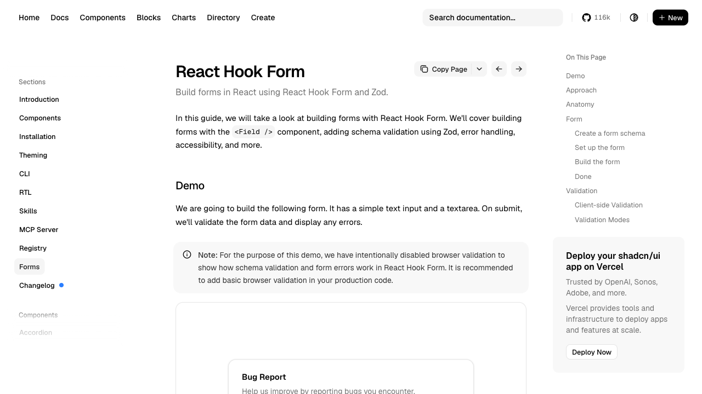
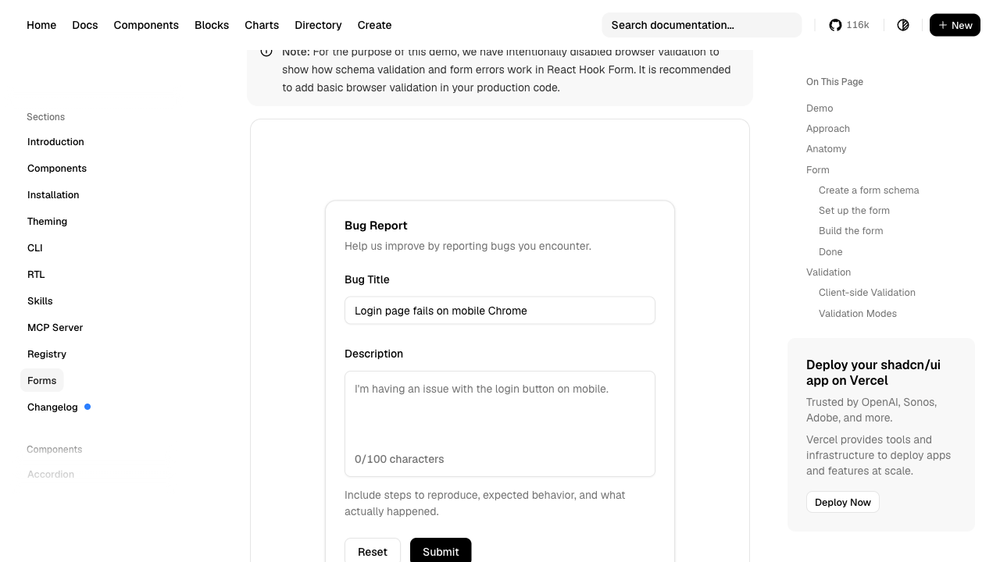

# 🤖 Website Automation Agent

An intelligent AI-powered browser automation agent capable of autonomously navigating web pages, identifying interactive form elements visually, and filling them out — without any hardcoded DOM CSS selectors.

Built using **Playwright** (browser control) and **Google Gemini 3.5/2.5 Flash** (multimodal vision & reasoning).

---

## 📸 Interactive Demonstration

Here is the agent in action executing the target form-filling task at `ui.shadcn.com`:

### 1. Initial State (Navigating & Scrolling)
The agent opens Chromium, navigates to the React Hook Form documentation, and scrolls down to locate the interactive **Bug Report** form component.



### 2. Auto-Filled State (Success)
The agent visually localizes the form input elements on the card, focuses each field, and types the values mimicking human keypress delays.



---

## 📋 Table of Contents

- [How It Works](#how-it-works)
- [Prerequisites](#prerequisites)
- [Installation](#installation)
- [Project Structure & Git Rules](#project-structure--git-rules)
- [Running Locally](#running-locally)
- [Cloud Hosting (GitHub Actions)](#cloud-hosting-github-actions)
- [Architecture Details](#architecture-details)

---

## How It Works

The agent runs a continuous **Observe → Think → Act** loop:

```
┌─────────────┐     ┌─────────────┐     ┌─────────────┐
│   OBSERVE   │────▶│    THINK    │────▶│     ACT     │
│             │     │             │     │             │
│ Capture PNG │     │ Send image  │     │ Playwright  │
│ screenshot  │     │ to Gemini   │     │ mouse/kbd   │
└─────────────┘     └─────────────┘     └─────────────┘
       ▲                                       │
       └───────────────────────────────────────┘
                     (repeat)
```

1. **Observe:** Playwright captures a screenshot of the browser viewport.
2. **Think:** The screenshot + action history + instructions are sent to Google Gemini. Gemini analyzes the visual space and estimates the exact coordinate points `(x, y)` of the target fields.
3. **Act:** Playwright dispatches mouse clicks at the precise coordinates and types text with a `50ms` typing delay.
4. **Repeat:** The loop continues until the form is submitted and the agent signals task completion.

---

## Prerequisites

- **Node.js** v18 or later
- **npm** (comes with Node.js)
- A **Google Gemini API Key** — [Get one free here](https://aistudio.google.com/apikey)

---

## Installation

### 1. Clone the project and install node modules
```bash
git clone https://github.com/AditeeySingh/Website-Automation-Agent.git
cd Website-Automation-Agent
npm install
```

### 2. Install Playwright browser binaries
```bash
npx playwright install chromium
```

### 3. Setup configuration variables
Copy the template configuration file:
```bash
cp .env.example .env
```
Open `.env` and paste your API key:
```
GEMINI_API_KEY=AIzaSy...your_key_here
```

---

## Project Structure & Git Rules

When uploading or modifying the project on GitHub, follow this structure and make sure to respect what is sent versus what is held back.

```
Website-Automation-Agent/
├── .github/workflows/
│   └── run-agent.yml  ← [TRACKED] GitHub Actions CI/CD Cloud Runner
├── assets/            ← [TRACKED] Static screenshots showing project works (used in README)
├── src/               ← [TRACKED] Core Source Code
│   ├── main.js        ← Entry point (task definitions)
│   ├── agent.js       ← Observe-Think-Act orchestrator
│   ├── tools.js       ← Playwright browser tool wrapper
│   ├── gemini.js      ← Gemini API client & system prompt
│   └── logger.js      ← Terminal & file logging utility
├── .gitignore         ← [TRACKED] Tells Git which files to hold back
├── .env.example       ← [TRACKED] Template for API key configuration
├── package.json       ← [TRACKED] Dependencies & run scripts
├── ARCHITECTURE.md    ← [TRACKED] In-depth design decisions
└── .env               ← [GITIGNORED] Contains private API keys (NEVER commit)
```

### 🛡️ File Security Rules
* **Files to Commit (Send):** Commit code, documentation (`README.md`, `ARCHITECTURE.md`), configuration templates (`.env.example`), and workflow files.
* **Files to Hold Back (Ignored):** Never commit the `.env` file (avoids leaking your Google API keys). Large dependencies (`node_modules/`) and local output artifacts (`screenshots/`, `logs/`) are also blocked by `.gitignore`.

---

## Running Locally

### Standard headed run:
This launches a visible Chromium browser window so you can watch the AI agent operate.
```bash
npm start
```

### Verbose mode (deep-dive console logs):
```bash
npm run demo
```

---

## Cloud Hosting (GitHub Actions)

This project is configured with a **GitHub Actions workflow** to run headlessly in the cloud.

### Setup Instructions:
1. Push your code to your repository: `https://github.com/AditeeySingh/Website-Automation-Agent`.
2. Go to your repository settings: **Settings** → **Secrets and variables** → **Actions**.
3. Click **New repository secret**, name it **`GEMINI_API_KEY`**, and paste your API key.
4. Go to the **Actions** tab on GitHub, select **Run Website Automation Agent**, and click **Run workflow**.
5. Once completed, download the generated **screenshots** or **logs** directly from the run dashboard!

---

## Architecture Details

- **Visual Coordinate Targeting:** Decoupled from HTML selectors. The agent is completely framework-agnostic because it uses pixel-space coordinate clicking (`mouse.click(x, y)`). It works on React, Vue, Svelte, or vanilla layouts.
- **Robust JSON Parser:** Uses bracket index matching to extract clean JSON blocks from model outputs even if the model responds with conversational headers/footers.
- **Resilient Retry Queue:** Implements exponential backoff to handle transient API issues, including rate limits (`429`) and server load spikes (`503`).
